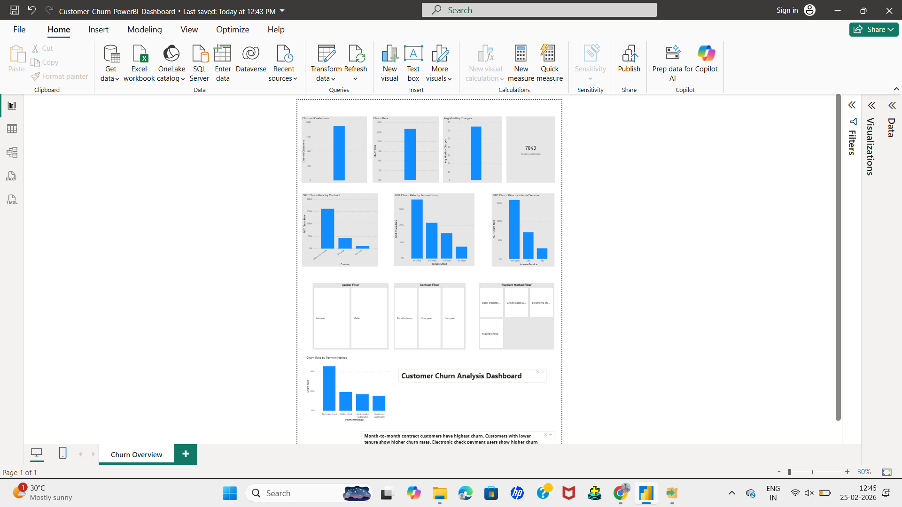

# Customer Churn Analysis Dashboard (Power BI)

## Overview
This project analyzes telecom customer churn using Power BI and DAX.

The dashboard provides business insights into customer retention patterns based on contract type, tenure, and payment methods.

---

## Key KPIs
- Total Customers
- Churned Customers
- Churn Rate
- Average Monthly Charges

---

## Key Insights
- Month-to-month contract customers show highest churn rate.
- Customers with lower tenure have higher churn probability.
- Certain payment methods correlate with increased churn.

---

## Tools Used
- Power BI
- DAX
- Data Modeling

---

## Dashboard Preview

